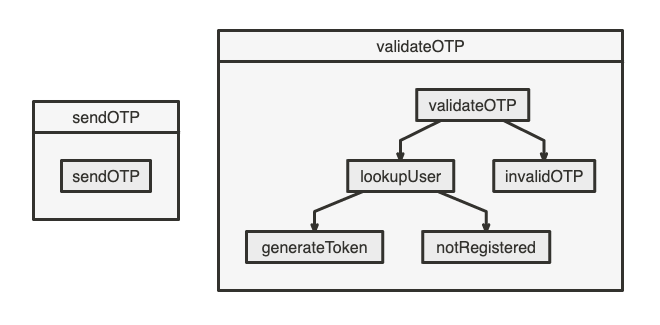

We need to methods to implement OTP signin with cloudobjects. These methods are `sendOTP`, `validateOTP` and `signUp`. We can use `User` class to add this methods.

Firstly we customize `preAuthorizer` to allow method calls from anonym users. Let's create `auth.ts` file. We'll use this file for otp related codes.

```ts
export async function preAuthorizer(data: Data): Promise<Response> {
    if (data.method.context.identity === 'Owner') return { statusCode: 200 }

    // OTP methods can be called bu anyone
    if (['sendOTP', 'validateOTP'].includes(data.method.name)) {
        return { statusCode: 200 }
    }

    // User class specific control, don't allow users to use other's instance ids
    if (data.method.context.userId !== data.context.instanceId || data.method.context.identity !== 'enduser') {
        return {
            statusCode: 403,
        }
    }

    return { statusCode: 200 }
}
```

Now, we can add preAuthorizer to top of `template.yml`.

```yml
preAuthorizer: auth.preAuthorizer
# ...rest of file
```

## Methods

We use SDK and types heavily in this file. So, let's add this to top of `auth.ts`.

```ts
import SDK, { Data, InitResponse, Response, StepResponse } from './CloudObjects'

const sdk = new SDK()
```

Let's update our template to define methods.
```yml
...
methods:
    - method: sendOTP
      sync: true
      steps:
        - id: sendOTP
          handler: auth.sendOTP
    - method: validateOTP
      sync: true
      steps:
        - id: validateOTP
          handler: auth.validateOTP
        - id: lookupUser
          handler: auth.lookupUser
        - id: generateToken
          handler: auth.generateToken
        # we'll set response from other steps so we don't need handlers for this steps, just for flow
        - id: invalidOTP
        - id: notRegistered
      flow:
        - id: goToInvalidOTP
          direction:
            - validateOTP
            - invalidOTP
        - id: goToValidOTP
          direction:
            - validateOTP
            - lookupUser
        - id: goToUserExists
          direction:
            - lookupUser
            - generateToken
        - id: goToUserNotExists
          direction:
            - lookupUser
            - notRegistered
...
```

Final template should look like this.


### - sendOTP

In this method, we need to create a otp code and send it to user's phone.

```ts
function generateRandomOTP(): string {
    const otp = Math.floor(Math.random() * (9999 - 1000 + 1)) + 1000
    return otp.toString()
}

export async function sendOTP(data: Data): Promise<StepResponse> {
    const otp = generateRandomOTP() // random 4 digit number between 1000-9999

    // get user's phone number from client
    const { phoneNumber } = data.method.request

    // use rbs actions to send otp sms
    const { errors } = await sdk.rbsAction({
        name: 'rbs.sms.request.SEND',
        data: { type: 'otp', phoneNumber, message: `Doğrulama kodunuz: ${otp}` },
    })

    if (errors.length === 0) {
        // we need to store otp code to access from validateOTP method
        data.state.private.otp = otp
    } else {
        data.method.response = {
            statusCode: 500,
            body: { errors },
        }
    }

    return data
}
```

### - validateOTP

After sending otp code to user's phone, we check if user enters rigth code to signin. We can check private state for that.

`validateOTP` method consist of several steps. We check if otp is valid, and we check if user registered, if so we can create custom token to signin or inform user to register.

```ts
// first flow
export async function validateOTP(data: Data): Promise<StepResponse> {
    if (data.state.private.otp === data.method.request.otp) {
        data.nextFlowId = 'goToValidOTP'
    } else {
        data.nextFlowId = 'goToInvalidOTP'
        data.method.response = {
            statusCode: 403,
            body: { error: 'invalidOTP' },
        }
    }

    return data
}

// goToValidOTP flow
export async function lookupUser(data: Data): Promise<StepResponse> {
    const { success: userFound } = await sdk.getLookUpKey({
        key: {
            name: 'phoneNumber',
            value: data.method.request.phoneNumber,
        },
    })

    if (userFound) {
        data.nextFlowId = 'goToUserExists'
    } else {
        data.nextFlowId = 'goToUserNotExists'
    }

    return data
}

// goToUserExists flow
export async function generateToken(data: Data): Promise<StepResponse> {
    const { response } = await sdk.rbsAction({
        name: 'rbs.core.request.GENERATE_CUSTOM_TOKEN',
        data: { userId: data.method.context.userId, roleNames: ['enduser'] },
    })

    data.method.response = {
        statusCode: 200,
        body: {
            customToken: response.customToken,
        },
    }

    return data
}

//
```
