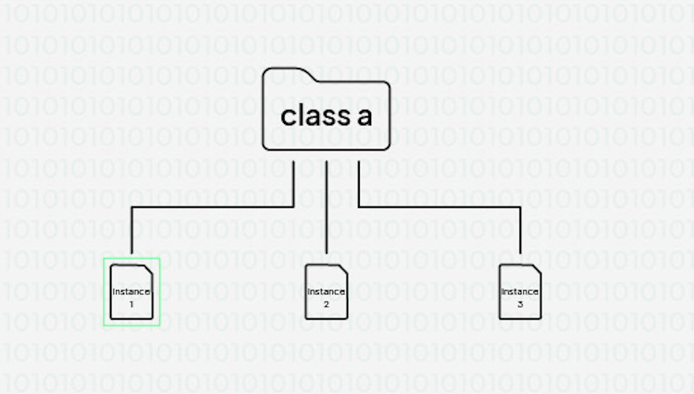
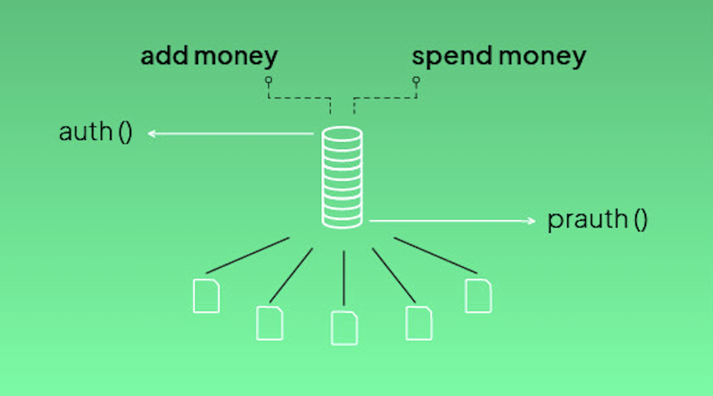
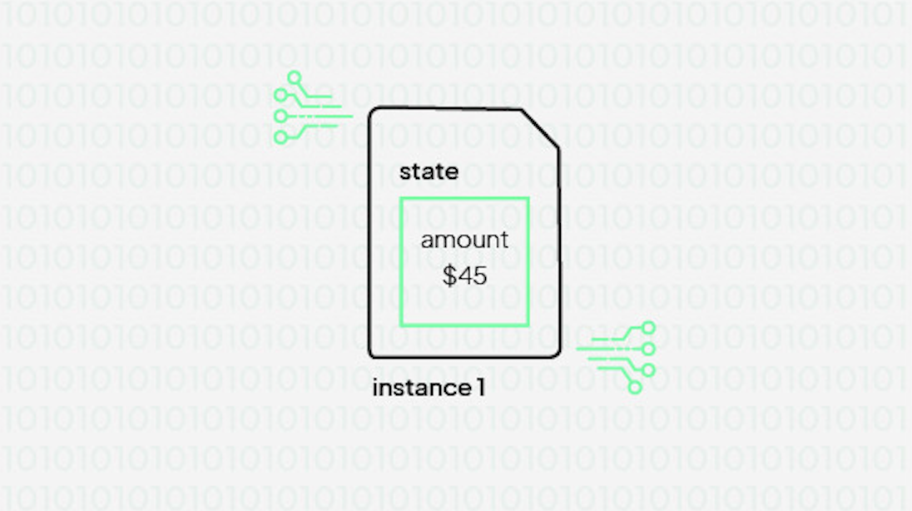
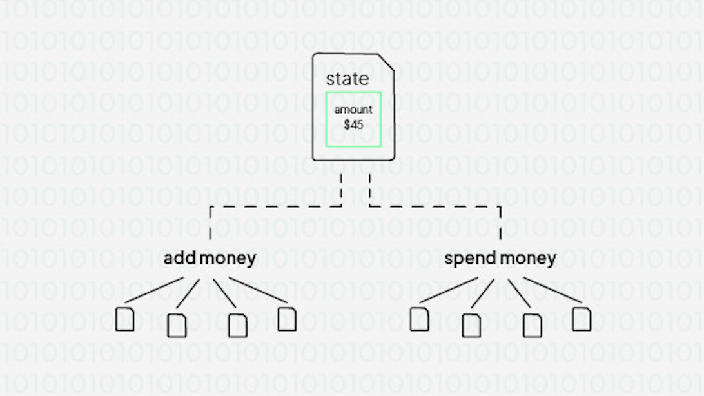

# Authorization

Every incoming request has a context. This context contains some information and it's interface is like below:


```typescript
export interface Context {
    requestId: string
    projectId: string
    action: string
    identity: string
    headers?: KeyValue
    classId: string
    instanceId?: string
    methodName: string
    refererClassId?: string
    refererInstanceId?: string
    refererMethodName?: string
    refererUserId?: string
    refererServiceId?: string
    refererIdentity?: string
    claims?: KeyValue
    isAnonymous?: boolean
    culture?: string
    platform?: string
    userId?: string
    sourceIP: string
    sessionId?: string
    clientOs?: string
}
```

This context object is delivered to your code like below:

```typescript
export async function sayHello(data: Data): Promise<StepResponse> {
    console.log(data.context)
    return data
}
```
For authorization we can use several of these fields:

- __identity__: Name of the role used to make this request.
- claims: Token claims.
- serviceId
- __userId__: Users ID making this request. Can be null if this request is coming from a service or anonymous rest call.
- sourceIP: IP adress this request is coming from.
- isAnonymous: A boolean field indicating if the caller is a anonymous user. 

## Authentication

Your classes are public on the internet. Anybody can call their methods. There are several methods to prevent unauthorized access. Let's first talk about users and services.

### Users or services

A caller can be either a user or a service. If you use the rest api and send requests without any access token, your context.identity will be rbs_anonymous_service. Other than this scenario there always must be a token in the request. Token management is usually done by sdk's.

By default any request sent to server side is made with anonymous users. An anonymous user is created on the fly and request is made. If so, isAnonymous field will be "true" in the context.

## Authorization

Now that we know that there will be a identity in the context object let's talk about how to use it.

We know that cloud object methods are called in a fifo manner.

Let's say we have a wallet class holding a single amount value in its state.


We might have methods on this class:


Everytime these are called they are ordered:


<<<<<<< Updated upstream
You can define two authorization methods in your template:

=======
You can define two authorization method in your template:
//IMAGE
>>>>>>> Stashed changes

```typescript
authorizer: index.authorizer
```

### authorizer 

- authorizer is called in the queue. So each call to this function is ordered. You can check your state safely and make decisions.
- authorizer is called with the state data.

Below there is an authorizer checking the state if this method can be called by this user:

```typescript
export async function authorizer(data: Data): Promise<Response> {
    if(data.context.methodName === "playHand" && 
        data.state.private.currentPlayerId !== data.context.userId) 
        return { statusCode: 403 }
    return { statusCode: 200 }
}
```