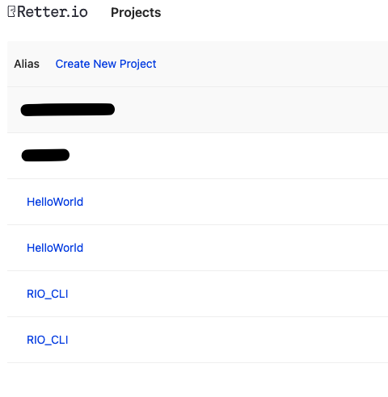

# New Project

## Project Initialization
If we had successfully logged in, we can initialize our project with decided PROJECT_ALIAS. 

```shell
> rio init PROJECT_ALIAS
```

After this command you have a working project in your system. You can check it by revisiting "https://c.retter.io"' s Projects page. There you will see a project with your defined PROJECT_ALIAS.

