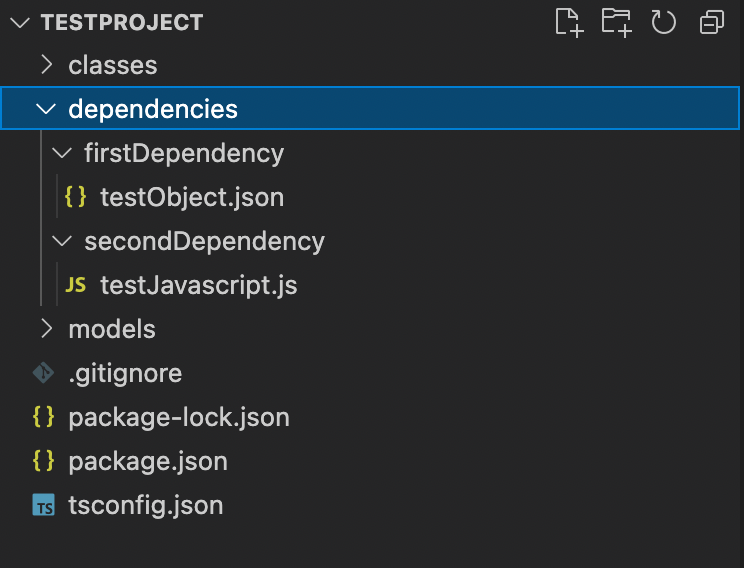

# Dependendices
Dependencies can be used for setting project scoped variables. This variable can be anything like function, object, constant etc. This configuration allows user to edit a project scoped variable without changing it in every class/method it is used.

## Setting a Dependency

For now, dependencies can be set in your local project folder. After creating a a folder named dependencies in your project folder, you can create your dependency folder or file under that path. In the end, your files should be looking like this:



## Usage in Code
After completing the configurations of your dependency and deploying your project, you have to specify your dependency in class template


```yaml
authorizer: index.authorizer
init: index.init
getState: index.getState
dependencies: 
  - firstDependency
  - secondDependency
methods:
  - method: test
    tag: test
    sync: true
    handler: index.test
```

Finally, your variable can be reached in your code: 

```typescript
import RDK, { Data, InitResponse, Response, StepResponse } from "@retter/rdk";
import {userName, password} from './dependencies/firstDependency/testObject.json'


export async function foo(data: Data): Promise<Data> {
    if(data.request.body.userName===userName){
        data.response= {statusCode: 200, body: 'success'};
    }
    return data
}

```