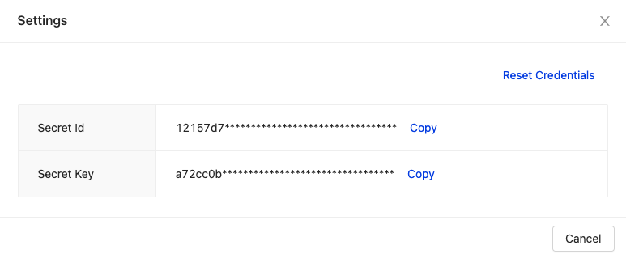
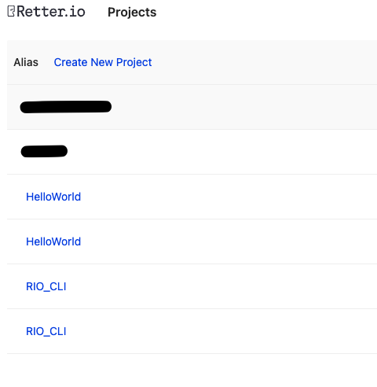

# Get Started With CLI
This article shows how to setup Rio' s CLI (Command Line Interface) and create a new project. So we can use Rio with our prefered IDE.
You can also watch "https://www.youtube.com/watch?v=VR7xygriFRE" to follow along.

## Installation

```shell
> npm i -g @retter/rio-cli
```

---
**NOTE**

If you get "The operation was rejected by your operating system." error in this setup, you can add `sudo` before each command.

---

## Setting Up Your Profile With CLI
After CLI setup is complete, we can set your profile up. To do this visit "https://c.retter.io" and login. Than open settings ``Rbs Console > Right Top Dropdown Menu > Settings``. There you will see your SECRET_ID and SECRET_KEY.



Decide your PROFILE_NAME and run the following command with your own PROFILE_NAME, SECRET_ID and SECRET_KEY.

```shell
> rio set-profile --profile-name PROFILE_NAME --secret-id SECRET_ID --secret-key SECRET_KEY
```

To see if your profile had been initialized, run the following command.

```shell
> rio list-profiles
```

## Project Initialization
If we had successfully logged in, we can initialize our project with decided PROJECT_ALIAS. 

```shell
> rio init PROJECT_ALIAS
```

After this command you have a working project in your system. You can check it by revisiting "https://c.retter.io"' s Projects page. There you will see a project with your defined PROJECT_ALIAS.



## Generating Classes

``rio generate``

Create the rio file for each of classes

```shell
> rio generate
```

#### Example:

```shell
> rio init TEST
> cd TEST
> rio generate # optional
> rio pre-deploy # optional
> rio deploy
```

### Project Pre-Deployment

This step does not make any changes. Just only detects changes

```shell
> rio pre-deploy
```

### Project Deployment

```shell
> rio deploy
```


