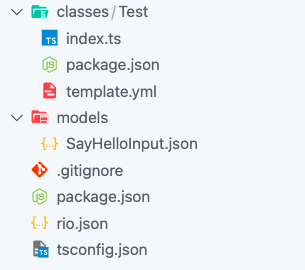

# Setting Up Your Enviroment

This guide will help you to install `rio-cli` and deploy your code. 

Firtly, you need a [c.retter.io](https://c.retter.io) account. If you don't have one, go to [c.retter.io](https://c.retter.io) and sign up for your free acoount.

## Installing CLI Tool

Then, install the `rio-cli` from npm with terminal you choose.

```bash
npm i -g @retter/rio-cli
```

You can check if installation successful with running `rio` command. It will show all available commands.

To use rio command, you must be authorized. To do that, you can profiles. To set an profile you need secret id and secret key. You can get them from Rio console.

> Rio Console > Right Top Dropdown Menu > Settings

Now, you can run `set-profile` command as seen below.

```bash
rio set-profile --profile-name PROFILE_NAME --secret-id SECRET_ID --secret-key SECRET_KEY
```

**You can use profiles with adding `--profile PROFILE_NAME` flag to any rio command.**

## Creating A Project

To create new project, just run `init` command with an alias in desired path. It will create new folder with given alias.

```bash
rio init <ProjectAlias>
```

It will show you the `projectId` created. Navigate to created directory and open with your favorite editor. Project structure look like this.


## Creating Classes

You can create a class in the `classes` directory. Directory name will be your class name. Each class must have a `template.yml`, `package.json` and corresponding `.ts` file. 

> Can be examined created dummy `Test` class.

## Typescript Helper File

With `rio generate` command you can create `rio.ts` files to use typescript helpers.

With `rio.ts` file, you can call other classes in the project or can access to models's interfaces.

## Deploy

**You must deploy your code to become accessible.**  To deploy you can run:

```bash
rio deploy
```

## That's it!
Congratulations! You've successfully created and deployed your rio project.
