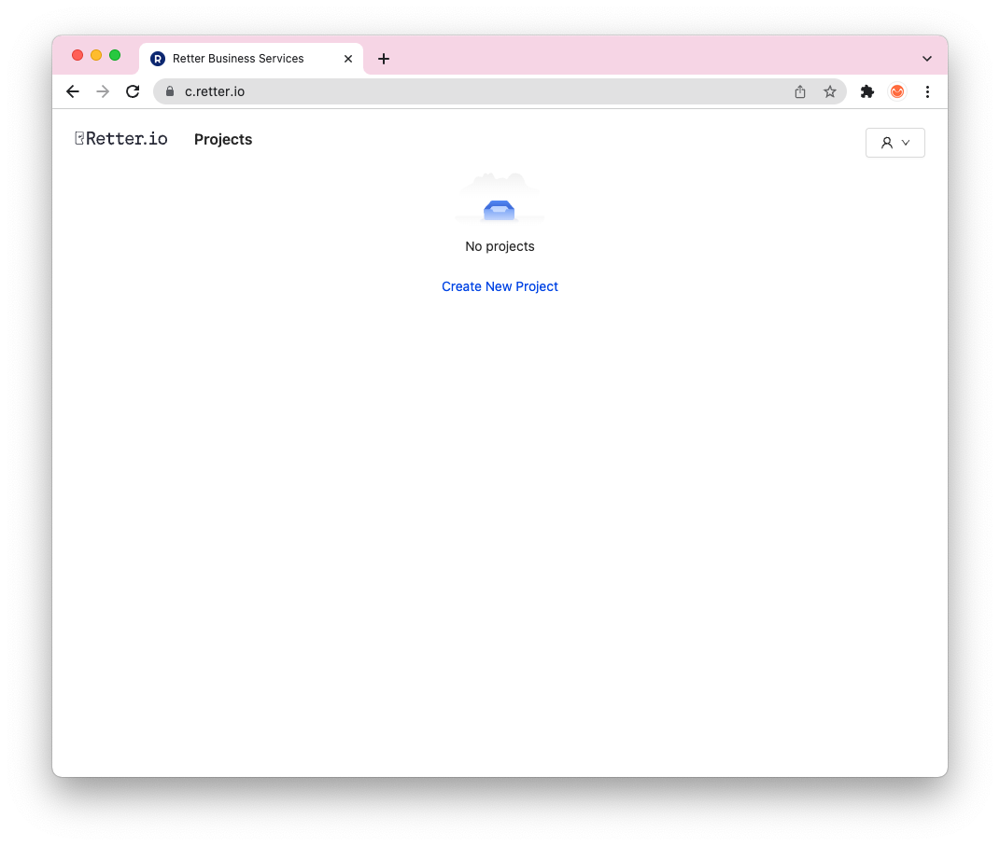
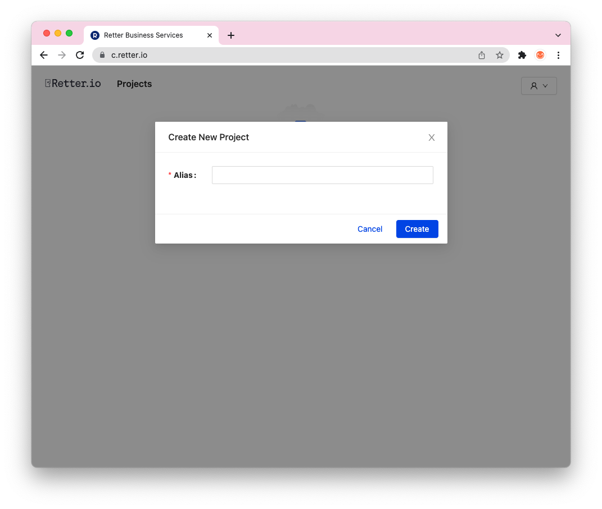
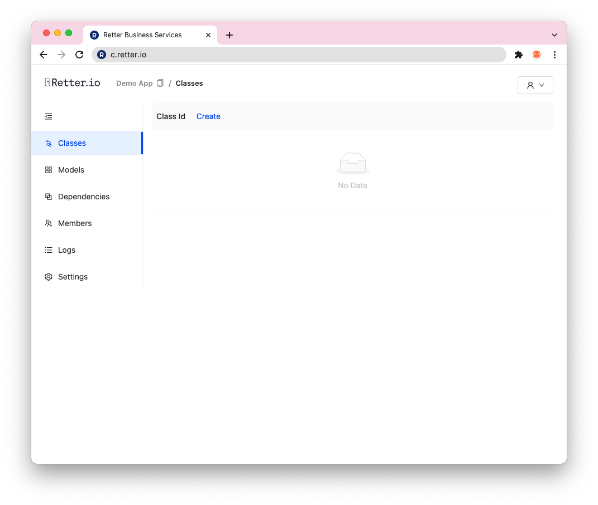

# Your First Project

This guide help you to create your first project with Retter Console.

## Creating a project

To create a new project, head to [Rio Console](https://c.retter.io) and log in. After successful login, you can create your first Rio project.



Click to `Create New Project` button. Then choose an alias to your first project.



And, congratulations. You created the first Rio Project. Now on, we can continue to create classes.

## Creating a class

As you know, Rio is an object-oriented cloud provider. We can define our classes and models, create an class instance etc. In this section you will be learn how to create class using Rio Console.



Click the `Create` button and name the class you want to create. After class creation, you'll see the class contents.

A class consist of `template.yml`, `package.json`, and typescript user codes. This tutorial we won't dive into details. You can find detailed explanations on [References](/Reference) section.

In `template.yml` file, you can configure how to interact with a class. You can point to methods using file name and method name with dot notation like `fileName.methodName`. File name refers to typescript file and method name refers to function exported on that file.

```yaml
# template.yml
authorizer: index.authorizer
init: index.init
getState: index.getState
methods:
    - method: sayHello
      tag: test
      sync: true
      handler: index.sayHello
```

You can use `npm` packages with classes. Just add any package to dependencies.

```json
// package.json
{
    "name": "simple",
    "version": "1.0.0",
    "dependencies": {
        "@retter/rdk": "1.1.2"
    }
}
```


```ts
import RDK, { Data, InitResponse, Response, StepResponse } from '@retter/rdk'

const rdk = new RDK()

export async function authorizer(data: Data): Promise<Response> {
    return { statusCode: 200 }
}

export async function init(data: Data): Promise<InitResponse> {
    return { state: { public: { message: 'Hello World' } } }
}

export async function getState(data: Data): Promise<Response> {
    return { statusCode: 200, body: data.state }
}

export async function sayHello(data: Data): Promise<StepResponse> {
    data.response = {
        statusCode: 200,
        body: { message: data.state.public.message },
    }
    return data
}
```
